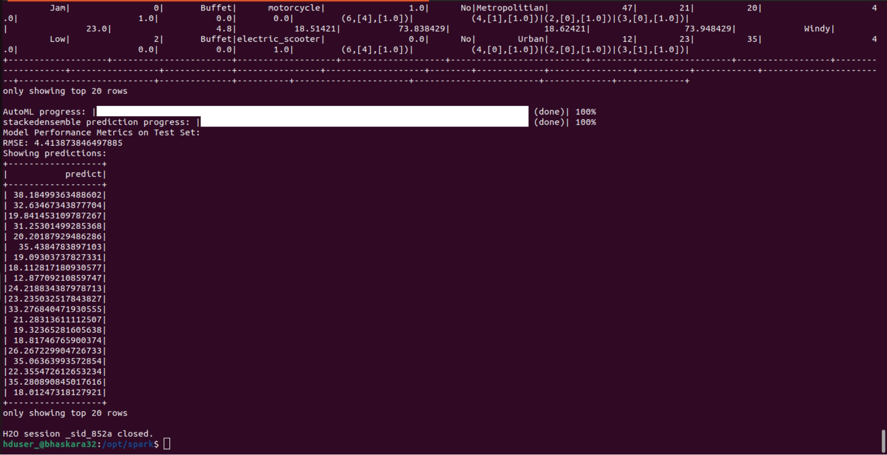
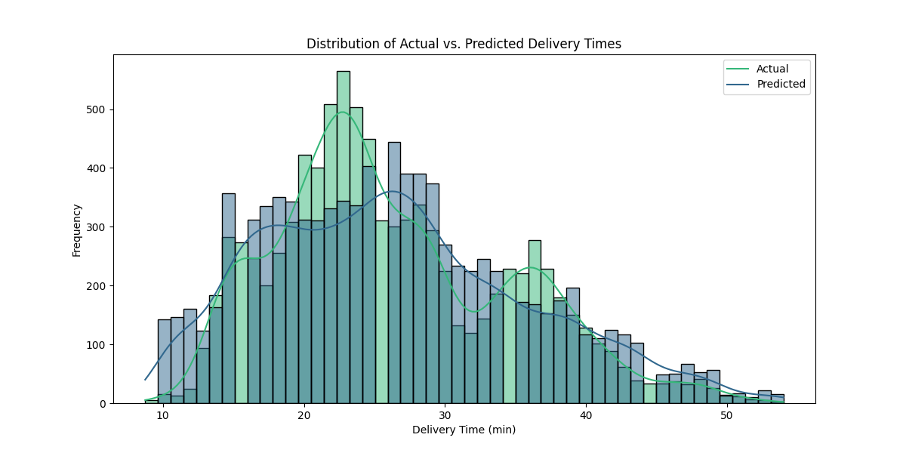

# Sparkling-Water-Delivery-Time-Prediction
# Sparkling Water Delivery Time Prediction

## Overview

This project aims to predict delivery time on Zomato using a distributed computing approach with Sparkling Water, a framework by H2O.ai that integrates H2O’s machine learning capabilities with Apache Spark. By leveraging the power of a multinode Spark cluster, we can efficiently handle large datasets and complex computations, ensuring faster processing and model training.

## Project Steps

1. **Setting up a multinode Spark cluster**
   - Configure and set up a multinode Spark cluster environment for distributed computing.

2. **Initiating Spark Session and H2O Context**
   - Start a Spark session and create an H2O context across the cluster to utilize H2O's machine learning algorithms.

3. **Loading and Preprocessing Data**
   - Load the dataset and preprocess it to handle missing values and prepare it for model training.

4. **Training Machine Learning Model**
   - Utilize H2O’s machine learning algorithms to train a model for predicting delivery times based on input features.

5. **Evaluating Model Performance**
   - Evaluate the model's performance using metrics such as Root Mean Square Error (RMSE) and visualize prediction results.

6. **Making Predictions**
   - Use the trained model to make predictions on new data to estimate delivery times.

## Repository Structure

- **data/:** Directory containing dataset files for training and testing.
- **sparkling_water_running_images/:** Directory with images showing various stages of the project.
- **spark3.py:** Main Python script for running the project.
- **requirements.txt:** List of dependencies required for the project.
- **Project Work Outline.txt:** Detailed outline of the project work.
- **instructions.txt:** Instructions for setting up and running the project.

## Data Folder

The `data` folder contains dataset files used for training and testing the model.

## Images Folder

The `images` folder contains screenshots of project stages and outputs, including model training and prediction results.

## Running the Project

Follow the instructions in `instructions.txt` to set up and run the project.

## Output

### Prediction Performance

The Root Mean Square Error (RMSE) of our prediction model is 4.41.

### Screenshots

- **Model Training Prediction:** 
  
  
- **Actual vs Predicted Delivery Time Plot:** 
  

## Contributing

Contributions are welcome! Feel free to open an issue or submit a pull request for any changes or improvements.

---

This README provides an overview of the project, its goals, steps involved, repository structure, instructions for setup and usage, and information on how to contribute. Customize it further based on specific details or additional features of your implementation.
